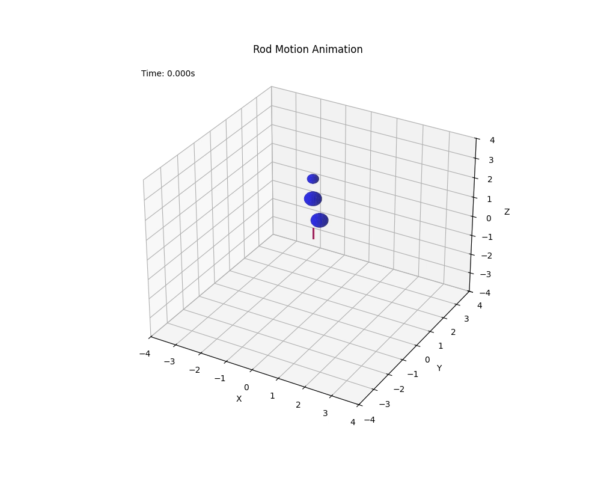

# SoftRoboticaSimulator

## install
```shell
conda create -n ssim python=3.11
conda activate ssim

pip install torch==2.5.1 torchvision==0.20.1 torchaudio==2.5.1 --index-url https://download.pytorch.org/whl/cu118
pip install pyelastica
pip install -r requirements.txt
pip install -e.
```
适配mesh surface
注释掉elastica/modules/contact.py中第67-75行contact合法性检验

适配 mesh rigid
注释掉 elastica/memory_block/memory_block_rigid_body.py 第48-49行

RodMeshSurfaceContact jit加速数据类型不对齐bug
elastica/mesh/mesh_initializer.py 第92行，修改为
```python
self.face_normals = self.face_normal_calculation(self.mesh.face_normals.astype(np.float64))
```
### POVRay
```shell
wget https://github.com/POV-Ray/povray/archive/refs/tags/v3.7.0.10.zip
unzip povray-3.7.0.10.zip
cd povray-3.7.0.10/unix

sudo apt-get update
sudo apt-get install -y autoconf automake build-essential cmake libboost-all-dev libpng-dev libjpeg-dev libtiff-dev libopenexr-dev libsdl1.2-dev

./prebuild.sh
cd ..
./configure COMPILED_BY="Your name <your email@address>" --with-x
sudo make install
```
### ffmpeg
```shell
sudo apt-get update
sudo apt-get install -y build-essential git yasm nasm libx264-dev libx265-dev libvpx-dev libfdk-aac-dev libmp3lame-dev libopus-dev
wget https://github.com/FFmpeg/FFmpeg/archive/refs/tags/n7.1.1.zip
unzip FFmpeg-n7.1.1.zip
cd FFmpeg-n7.1.1
./configure --enable-ffplay --enable-ffserver
make;make install
```
## grab ball

<div style="text-align: center;">
  
</div>

<div style="text-align: center;">
  
</div>

## VLN Data Generate

Run the following scripts steply

```bash
python scripts/navigation/main_data_gen_random_go.py
python scripts/navigation/main_data_gen_prune.py # choiceable, if you want to make the road be short
python scripts/navigation/main_data_gen_obstacle_gen.py
python scripts/navigation/main_data_gen_target_gen.py
python scripts/navigation/main_data_gen_full.py
python scripts/navigation/main_data_gen_meshes.py
python scripts/navigation/main_data_gen_visual_gen.py
python scripts/navigation/main_data_gen_release.py
```
